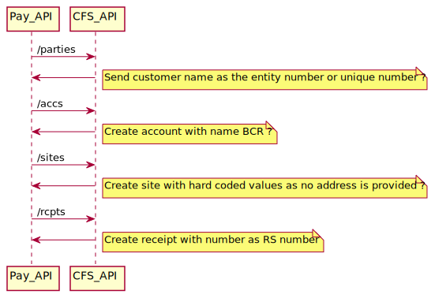
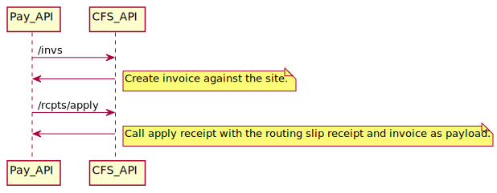
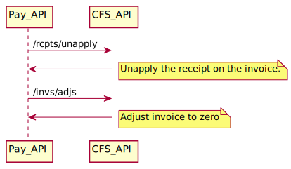
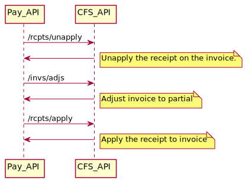
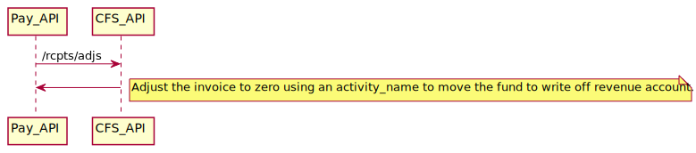
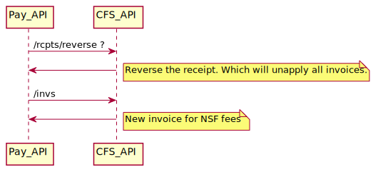
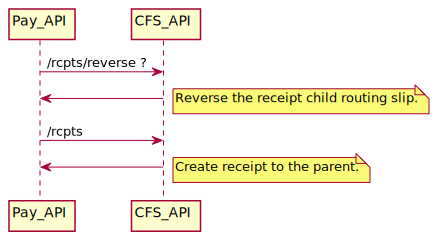

# FAS Integration points with CFS 

## Endpoints to call when routing slip is created

<!--
```
@startuml fas/routing_slip

Pay_API -> CFS_API: /parties
CFS_API -> Pay_API : 
note right
  Send customer name as the entity number or unique number ?
end note

Pay_API -> CFS_API: /accs
CFS_API -> Pay_API : 
note right
  Create account with name BCR ?
end note


Pay_API -> CFS_API: /sites
CFS_API -> Pay_API : 
note right
  Create site with hard coded values as no address is provided ?
end note


Pay_API -> CFS_API: /rcpts
CFS_API -> Pay_API : 

note right
  Create receipt with number as RS number
end note


@enduml
```
-->
 

## Endpoints to call on invoice (transaction) creation

<!--
```
@startuml fas/routing_slip_transaction

Pay_API -> CFS_API: /invs
CFS_API -> Pay_API : 
note right
  Create invoice against the site.
end note

Pay_API -> CFS_API: /rcpts/apply
CFS_API -> Pay_API : 
note right
  Call apply receipt with the routing slip receipt and invoice as payload.
end note


@enduml
```
-->
 


## Endpoints to call when invoice (transaction) is cancelled

<!--
```
@startuml fas/cancel_transaction

Pay_API -> CFS_API: /rcpts/unapply
CFS_API -> Pay_API : 
note right
  Unapply the receipt on the invoice.
end note

Pay_API -> CFS_API: /invs/adjs
CFS_API -> Pay_API : 
note right
  Adjust invoice to zero
end note


@enduml
```
-->
 

 ## Endpoints to call when invoice (transaction) is partially cancelled

<!--
```
@startuml fas/cancel_transaction_partial

Pay_API -> CFS_API: /rcpts/unapply
CFS_API -> Pay_API : 
note right
  Unapply the receipt on the invoice.
end note

Pay_API -> CFS_API: /invs/adjs
CFS_API -> Pay_API : 
note right
  Adjust invoice to partial
end note

Pay_API -> CFS_API: /rcpts/apply
CFS_API -> Pay_API : 
note right
  Apply the receipt to invoice
end note

@enduml
```
-->
 


## Endpoints to call when refund is approved.

<!--
```
@startuml fas/refund_approved

Pay_API -> CFS_API: /rcpts/adjs ?
CFS_API -> Pay_API : 
note right
  Adjust the receipt to zero using an activity_name to move the fund to refund revenue account.
end note


@enduml
```
-->
 


## Endpoints to call to write off a routing slip (< $10)

<!--
```
@startuml fas/write_off

Pay_API -> CFS_API: /rcpts/adjs
CFS_API -> Pay_API : 
note right
  Adjust the invoice to zero using an activity_name to move the fund to write off revenue account.
end note

@enduml
```
-->
 


## Endpoints to call when cheque is bounced

<!--
```
@startuml fas/nsf

Pay_API -> CFS_API: /rcpts/reverse ?
CFS_API -> Pay_API : 
note right
  Reverse the receipt. Which will unapply all invoices.
end note

Pay_API -> CFS_API: /invs
CFS_API -> Pay_API : 
note right
  New invoice for NSF fees
end note


@enduml
```
-->
 

## Endpoints to call when RS is linked

<!--
```
@startuml fas/link

Pay_API -> CFS_API: /rcpts/reverse ?
CFS_API -> Pay_API : 
note right
  Reverse the receipt child routing slip.
end note

Pay_API -> CFS_API: /rcpts
CFS_API -> Pay_API : 
note right
  Create receipt to the parent.
end note


@enduml
```
-->
 

